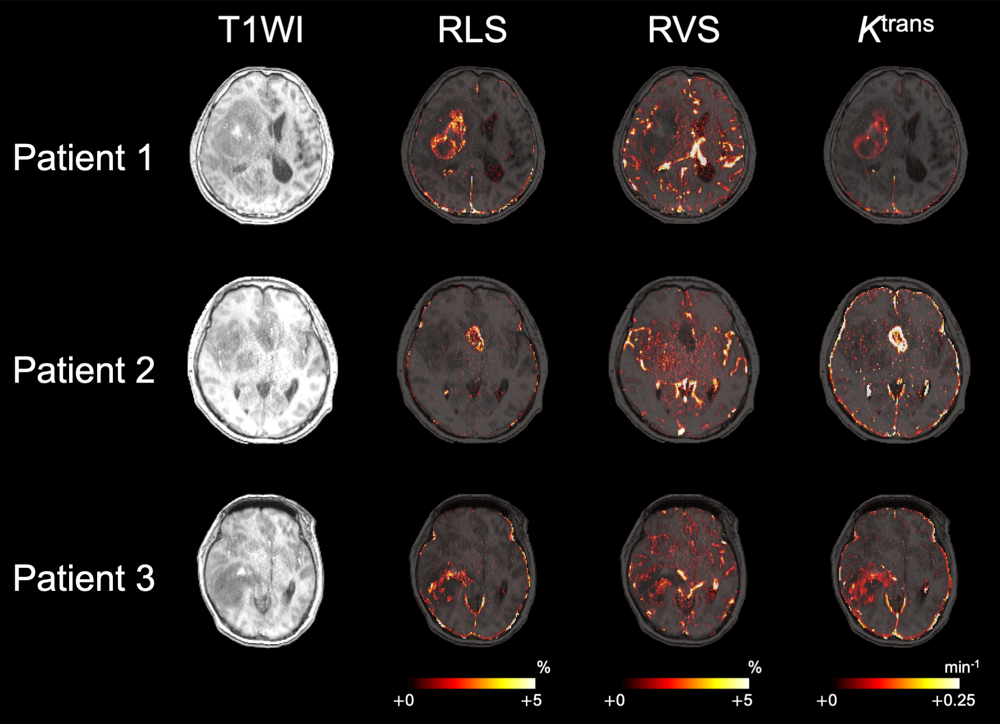
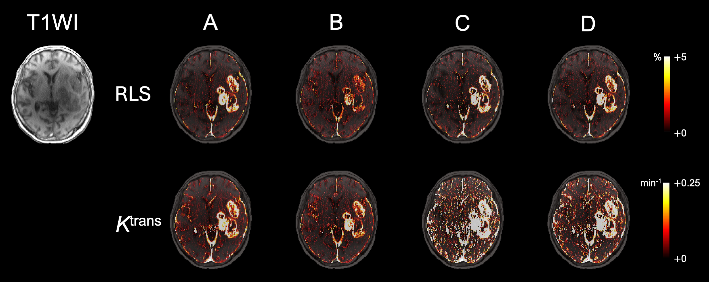

# Unsupervised-BBB-DCE
The official repository for "Unsupervised Deep Learning for Model-Free Blood‒Brain Barrier Leakage Detection with Dynamic Contrast-Enhanced MRI in Diffuse Gliomas" published on _Radiology: Artificial Intelligence_.


## Introduction

This repository provides an unsupervised learning framework for detecting blood-brain barrier leakage without relying on pharmacokinetic models or arterial input function.


**Figure: Representative RLS, RVS, Ktrans maps**


**Figure: RLS, Ktrans maps from subsampled data**


**Table: Comparison of the robustness of RLS and *_Ktrans_* to subsampling**

|            | r² (RLS) | r² (*Ktrans*) | *P value* | PSNR (mean ± SD dB, RLS) | PSNR (mean ± SD dB, *Ktrans*) | *P value* | SSIM (mean ± SD, RLS) | SSIM (mean ± SD, *Ktrans*) | *P value* |
|------------|---------|-------------|----------|----------------------|----------------------|----------|------------------|------------------|----------|
| **D_under**  | 0.90    | 0.90        | .89      | 36.19 ± 1.79         | 32.69 ± 2.96         | < .001   | 0.93 ± 0.02      | 0.92 ± 0.03      | .01      |
| **D_trunc**  | 0.89    | 0.72        | < .001   | 33.09 ± 1.91         | 28.94 ± 4.16         | < .001   | 0.92 ± 0.02      | 0.87 ± 0.05      | < .001   |
| **D_hybrid** | 0.92    | 0.91        | .45      | 37.25 ± 2.03         | 32.16 ± 3.90         | < .001   | 0.96 ± 0.02      | 0.93 ± 0.04      | < .001   |


## Requirements
```sh
pip install -r requirements.txt
```

## How to Run
Each Jupyter Notebook file runs sequentially to complete the full workflow.
